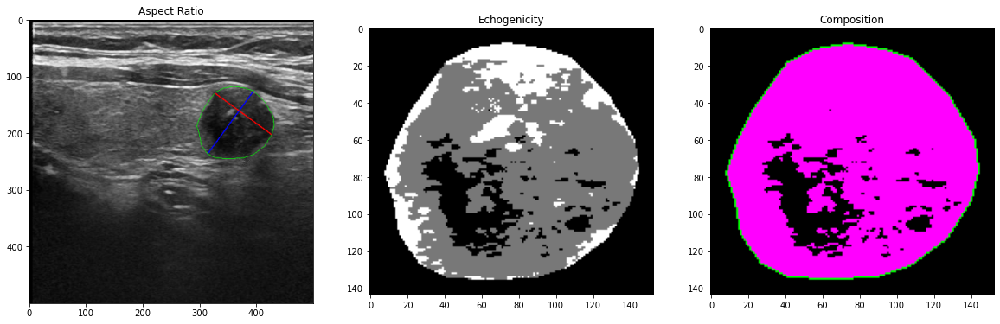
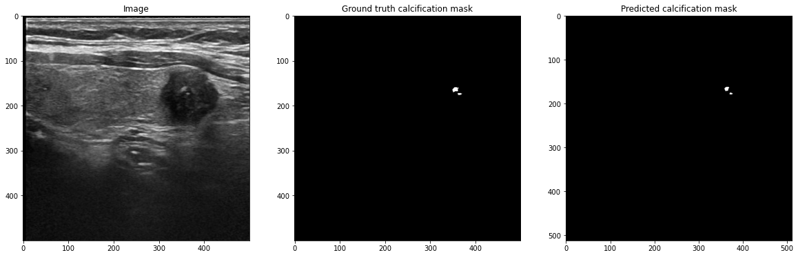

# ai_thyroid
An Ultrasound Computer-Assisted Diagnosis Model to Improve the Diagnostic Accuracy of the Suspicious Thyroid Nodules

## Clinical feature extraction
Module: ./ai_thyroid_clinical_feature 
- For feature extraction of Aspect Ratio, Echogenicity and Composition
- Example: feature_demo.ipynb

## Calcification segmentation
Module: ./ai_thyroid_calcification
- For thyroid nodule calcification segmentation
- Example: calcification_example.ipynb

## Malignancy assessment
Module: ./ai_thyroid_malignancy
- For malignancy classification

## Multi-task Net
Module: ./ai_thyroid_multi_task
- Experimental Multi-task segmentation and classification module
- For simplifying workflow
- No performance reduction in 2 segmentation tasks
